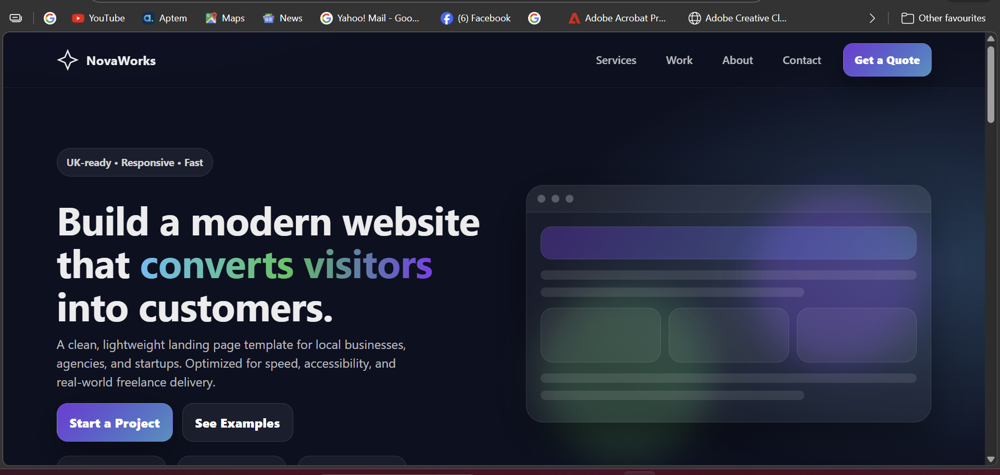

# 🚀 NovaWorks – Smart Business Landing Page

A modern, responsive business landing page built using pure HTML, CSS, and JavaScript.

Perfect for:
- Freelancers
- Agencies
- Local businesses
- Startup landing pages

---

## 🔥 Features

- Fully Responsive (Mobile First)
- Smooth Scroll Navigation
- Animated Scroll Reveal
- Scroll Progress Indicator
- Modern UI with Gradients
- Contact Form with Validation
- Clean 3-File Structure
- No frameworks used

---

## 🛠 Tech Stack

- HTML5
- CSS3 (Flexbox + Grid)
- Vanilla JavaScript (ES6)
- Intersection Observer API

---

## 📂 Project Structure

```
business-landing/
│
├── index.html
├── style.css
└── script.js
```

---

## 📸 Preview

### Desktop


### Mobile


---

## 🌍 Live Demo

> Add your GitHub Pages link here  
Example: https://yourusername.github.io/business-landing-page/

---

## 🎯 Purpose

This project is part of a professional web portfolio demonstrating:
- UI/UX fundamentals
- Clean code structure
- Client-ready landing page delivery

---

## 📩 Contact

If you'd like a custom version of this template, feel free to reach out.